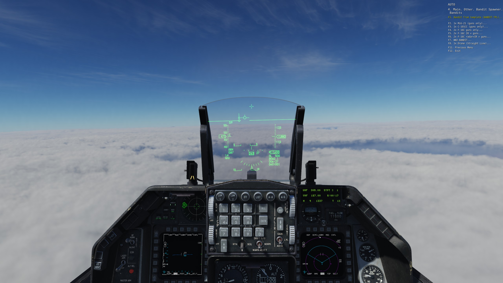
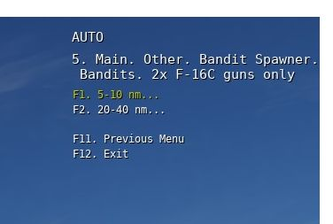
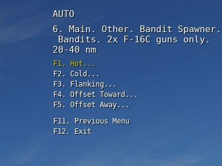
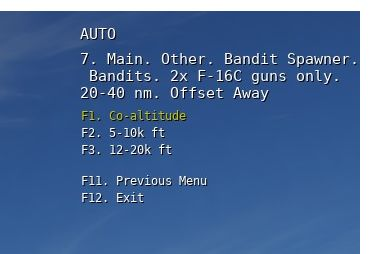
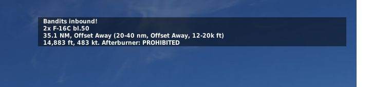

# BanditSpawner.lua — DCS "Instant Bandit" Radio Menu

The radio menu grows a **Bandit Spawner**:







A single-file mission script for [DCS World](https://www.digitalcombatsimulations.com/) that gives every player a personal **F10 radio menu** for spawning AI bandits (hostile aircraft) on demand.

Each player can click a menu item and a bandit group spawns **N nautical miles directly ahead of their aircraft**, pointed back at them, at a randomized speed, with the distance and altitude band picked from the radio menus — ready to fight. Bandits automatically join the **coalition opposite the clicking player**, carry an *Engage Air* task, and are forbidden from using afterburner (configurable).


---

## Table of Contents

- [Installation](#installation)
- [Quick Start](#quick-start)
- [Spawn Modes](#spawn-modes)
  - [Clone mode](#clone-mode)
  - [Build mode](#build-mode)
  - [Clone vs. build — what actually differs](#clone-vs-build--what-actually-differs)
- [Loadouts & Donor Groups (no CLSIDs)](#loadouts--donor-groups-no-clsids)
- [AO Mode (map-referenced spawns)](#ao-mode-map-referenced-spawns)
- [The Radio Menu](#the-radio-menu)
- [Configuration Reference](#configuration-reference)
  - [Geometry & flight parameters](#geometry--flight-parameters)
  - [Behavior options](#behavior-options)
  - [Spam control & limits](#spam-control--limits)
  - [Menu customization](#menu-customization)
  - [`spawns` entries](#spawns-entries)
- [Runtime Control Menu (ROE / Behavior / Despawn)](#runtime-control-menu-roe--behavior--despawn)
- [Behaviors: Intercept vs. Drone](#behaviors-intercept-vs-drone)
- [Bandit Ownership (`country`)](#bandit-ownership-country)
- [Troubleshooting & FAQ](#troubleshooting--faq)

---

## Installation

1. Open your mission in the **Mission Editor**.
2. Go to **Triggers** → add a new trigger:
   - **Type:** `ONCE`
   - **Condition:** `TIME MORE (0)`
   - **Action:** `DO SCRIPT FILE` → select `BanditSpawner.lua`
3. Save and fly.

> Alternatively, paste the entire file contents into a `DO SCRIPT` action.

The script needs no other files, no MIST, no Moose — it is fully self-contained and uses only the standard DCS scripting environment (`env`, `timer`, `trigger`, `coalition`, `world`, `missionCommands`).

---

## Quick Start

The script works out of the box with the default config. For the stock experience:

1. Place a **late-activation** aircraft group in the ME named `BANDIT-TPL` (give it the payload, skill, and liveries you want).
2. Load the script (see [Installation](#installation)).
3. In-flight, open **F10 → Bandit Spawner** and pick a spawn option.
4. Bandits appear in front of you, hot, and attack your coalition.

To customize what spawns, edit the `cfg` table near the top of the file (everything above the `INTERNALS` banner). You should never need to touch the code below it.

---

## Spawn Modes

Every entry in `cfg.spawns` uses one of two modes:

### Clone mode

```lua
{
  label    = "Bandit from template (BANDIT-TPL)",
  mode     = "clone",
  template = "BANDIT-TPL",   -- exact group name of a LATE ACTIVATION group in the ME
}
```

Duplicates a **late-activation** group you placed in the Mission Editor. The clone keeps the template's:

- Unit types and count
- Liveries
- Callsigns
- Skill (as set on the template in the ME)
- Payload — *unless* you use `payload_from` or set `override_clone_payload = true`

> **Note:** the template group's own *task* is ignored — spawned clones always get `cfg.task` (default `"Intercept"`), or a per-entry `task = "..."` override.

Clone mode is the easiest way to get fully-kitted bandits (external tanks, missiles, countermeasures, specific liveries): just build the template group visually in the editor and you're done.

### Build mode

```lua
{
  label     = "1x MiG-21 (guns only)",
  mode      = "build",
  airframe  = "MiG-21Bis",   -- exact unit type string from YOUR mission file
  count     = 1,
  skill     = "High",        -- optional, defaults to cfg.skill
}
```

Spawns a fresh group of the chosen airframe and count (1–8 aircraft, vic-ish formation). Without a `payload_from`, build-mode aircraft spawn **clean**: empty pylons, internal fuel, 100% gun ammo, no missiles.

> ⚠️ **Airframe names must match your mission file exactly.** DCS renames types between builds (e.g. `F-16C_50` became `F-16C bl.50`). A wrong string makes DCS *silently substitute a different aircraft* — this script detects the substitution and warns you on-screen and in `dcs.log`. To find the exact string: open the `.miz` as a zip, read `unit.type` in the `mission` file. (The old `F-16C_50` spelling still spawns via an alias, but donor matching follows the mission file name.)

### Clone vs. build — what actually differs

Both modes share everything downstream — spawn geometry, route & tasks, AI options (afterburner/jettison/RTB/ROE), coalition assignment, and the cooldown/limit/despawn bookkeeping. They differ only in how the group's contents come into being:

| | `clone` | `build` |
|---|---|---|
| Group contents | Deep-copied from the ME template | Generated from `airframe` + `count` |
| Count | Whatever the template has (no cap) | Clamped to 1–8 (default 2) |
| Skill | Per-unit, from the template in the ME | `cfg.skill` / per-entry `skill` (falls back to `"High"` on typos) |
| Default payload | The template's ME payload | Clean pylons + 100% gun |
| `payload_from` fails | Falls back to template payload | Falls back to clean |
| Liveries, callsigns, unit props | Preserved from the template | Generated defaults |
| Wrong type string | Not possible — types come from the mission | DCS silently spawns a different jet; the script detects it and warns |
| Failure mode | Spawn aborted, on-screen + log message | Usually still spawns, with warnings |

**Rule of thumb:** use `clone` when the bandit should be a mission object — specific liveries, mixed types, editor-built payloads, exact formation and skill. Use `build` for a quick generic threat configured purely in the script.

---

## Loadouts & Donor Groups (no CLSIDs)

You never need to handle raw CLSID pylon tables. Build loadouts **visually in the ME** using *donor groups*:

1. Place a **1-plane late-activation group** in the ME (e.g. `DONOR F16 IR`).
2. Open its payload window in the editor and build the loadout you want
   (guns only = clean, IR + guns = Sidewinders, radar+IR+guns+tanks = full AA, ...).
3. Reference it from the spawn entry:

```lua
{ label = "2x F-16C IR + guns", mode = "build", airframe = "F-16C bl.50",
  count = 2, payload_from = "DONOR F16 IR" },
```

The pylon table (and aircraft properties like CFTs) is **copied at runtime** from the donor, and gun ammo is topped to 100%.

More payload rules:

| Setting | Effect |
|---|---|
| `payload_from = "DONOR NAME"` | Copy the donor group's payload (works in both modes) |
| `payload_from = { ["F-5E-3"] = "DONOR A", ... }` | Per-unit-type donors, for mixed-type clone groups |
| `payload_from` absent, build mode | Clean loadout (empty pylons + 100% gun) |
| `payload_from` absent, clone mode | Clones keep the ME template's payload |
| `override_clone_payload = true` (global) | Strip *all* clones to clean pylons + full gun |
| `guns_full = true` (global) | Gun ammo always topped to 100% |

If a donor group is missing or contains no matching unit type, the script logs it and falls back (clone mode keeps the template payload; build mode spawns clean).

For single-type donors in build mode, a name mismatch is auto-corrected: the spawned aircraft adopts the donor's type (the log tells you to rename the entry's `airframe` to match).

---

## AO Mode (map-referenced spawns)

By default bandits spawn *ahead of whoever clicked*. For multiplayer dogfight servers that geometry differs per client. **AO mode** fixes the fight to a map reference instead — every client gets the same menu and the same geometry.

Give any spawn entry an `ao` field plus bearing and distance:

```lua
-- AO anchored to a trigger zone named "AO" in the ME
{
  label       = "2x MiG-21 inbound to the AO",
  mode        = "build",
  airframe    = "MiG-21Bis",
  count       = 2,
  ao          = "AO",          -- trigger zone name, or ao = { x = ..., z = ... }
  bearing_deg = 250,           -- spawn on this bearing FROM the AO (250 = from the WSW)
  distance_nm = 40,            -- ... this far out, then run inbound
},

-- AO with raw map coordinates (no ME zone needed)
{
  label       = "Bandit template to a fixed point",
  mode        = "clone",
  template    = "BANDIT-TPL",
  ao          = { x = -124000, z = 88000 },  -- x = north, z = east, meters
  bearing_deg = 90,
  distance_nm = 25,
},
```

How it works:

- `ao` accepts a **trigger zone name** or a raw point `{ x = ..., z = ... }` (x = north, z = east, in meters — read them from a temporary unit/zone in the saved mission file, where `y` in the mission file = this script's `z`).
- Bandits spawn on `bearing_deg` **from** the reference point, `distance_nm` out, and fly **inbound** toward it.
- Works with both `clone` and `build` mode.
- `attack_on_spawn` is ignored in AO mode (bandits hunt via the Engage Air task).
- AO entries are automatically grouped under their own **"AO Spawns"** menu page.

---

## The Radio Menu

Players get a personal **F10 → Bandit Spawner** menu (added when the script loads for airborne players, and on client birth for late joiners). Menu structure:

```
F10 / Bandit Spawner
├── Bandits                (player-relative spawns — only if AO entries also exist)
│   └── <bandit label>
│       └── <distance>         e.g. "5-10 nm", "20-40 nm"
│           └── <bearing mode> e.g. "Hot", "Cold", "Flanking"
│               └── <altitude> e.g. "Co-altitude", "5-10k ft", "12-20k ft"
├── AO Spawns              (map-referenced spawns — only if AO entries exist)
│   └── ...same nesting...
└── Bandit Spawner Control
    ├── Set ROE             → Weapon Free / Weapon Tight / Weapon Hold
    ├── Set Behavior        → Intercept / Drone
    └── Remove all spawned bandits
```

- The **distance / bearing / altitude tiers** are optional; nil or empty tables produce a flat list (geometry falls back to per-entry overrides or the built-in defaults — see Configuration Reference). If altitude modes are omitted, the nesting stops at bearing mode.
- DCS radio pages have only **10 usable slots** (F1–F10; F11/F12 are paging rows), so the script automatically splits bandits and AO entries onto separate pages, and warns at load time if any configured page would overflow.
- Restrict the menu to specific player groups with `cfg.player_groups = { "Viper-1", "Hornet-1" }` (exact group names; nil/empty = everyone).

### What the player sees on spawn

```
Bandits inbound!
1x MiG-21Bis
7.8 NM, Hot (5-10 nm, Hot, 12-20k ft)
13,405 ft, 437 kt. Afterburner: PROHIBITED
```

---

## Configuration Reference

Everything lives in the `BanditSpawner.cfg` table at the top of the file. Resolution order for any value: **menu choice → per-entry override → global config**.

### Geometry & flight parameters

| Key | Default | Description |
|---|---|---|
| `bearing_jitter_deg` | `0` | Random ± jitter on the spawn bearing (0 = dead ahead) |
| `min_alt_agl_ft` | `1000` | Floor — never spawn lower than this above terrain |
| `speed_kts` | `450` | Default speed, knots |
| `speed_var_kts` | `75` | Random ± around `speed_kts` (never slower than ~115 kts) |
| `skill` | `"High"` | AI skill in build mode: `Average`, `Good`, `High`, `Excellent`, `Ace` (case-insensitive; invalid values fall back to `High` with a log warning) |

Distance and altitude are **not** global knobs — they come from the radio-menu tiers (`spawn_distances_nm` / `altitude_modes`). Per-entry `distance_nm` / `alt_ft` / `alt_var_ft` overrides still apply, and if the menu tiers are disabled the built-in fallbacks kick in (10 nm; 10,000 ft ± 2,000 ft).

### Behavior options

| Key | Default | Description |
|---|---|---|
| `country` | `"opposite"` | Ownership of spawned bandits — see [below](#bandit-ownership-country) |
| `prohibit_ab` | `true` | AI forbidden from using afterburner (applied via controller option **and** a route Option task) |
| `guns_full` | `true` | Always give 100% gun ammunition |
| `no_jettison` | `true` | AI may not jettison external tanks/weapons (keeps the payload you gave them) |
| `engage_hostile_air` | `true` | "Engage Air" en-route task: actively attack enemy aircraft |
| `attack_on_spawn` | `true` | Add an *Attack Group* task targeting the clicking player's group (ignored in AO mode) |
| `task` | `"Intercept"` | Group mission task for **all** spawns (`"CAP"`, `"Intercept"`, `"Escort"`, ...); overrides the template's task in clone mode too |
| `behavior` | `"Intercept"` | Default behavior: `"Intercept"` or `"Drone"` — see [Behaviors](#behaviors-intercept-vs-drone) |
| `loiter_at_end` | `true` | Orbit (race-track) task on the last waypoint so bandits stay on station near the fight |
| `allow_rtb` | `false` | `false` = bandits never RTB on bingo fuel or winchester; they stay and fight |
| `default_roe` | `"Weapon Free"` | ROE applied to spawned bandits (drones always get Weapon Hold) |

### Spam control & limits

| Key | Default | Description |
|---|---|---|
| `cooldown_sec` | `5` | Per-player-group cooldown between spawns |
| `max_active` | `4` | Max simultaneously alive spawned bandit groups (0 = unlimited) |
| `allow_despawn` | `true` | Adds a "remove all spawned bandits" radio item |
| `despawn_label` | `"Remove all spawned bandits"` | Label for that item |
| `group_prefix` | `"BNDT-"` | Spawned group names: `BNDT-001`, `BNDT-002`, ... |

### Menu customization

**`menu_name`** (default `"Bandit Spawner"`) — root menu label. The control menu appends `" Control"`.

**`player_groups`** (default `nil`) — restrict the menu to exact player group names, e.g. `{ "Viper-1", "Hornet-1" }`. `nil` or empty = available to every player group.

**`spawn_distances_nm`** — nested menu distances. `nil`/empty = flat menu.

```lua
spawn_distances_nm = {
  { label = "5-10 nm",  dist_nm = 7.5, dist_var_nm = 2.5 },  -- randomized range
  { label = "20-40 nm", dist_nm = 30,  dist_var_nm = 10 },
  -- a plain number = exact distance, e.g. 15
},
```

**`bearing_modes`** — nested menu bearing modes:

```lua
bearing_modes = {
  { label = "Hot",           spawn_offset_deg = 0,   heading_offset_deg = 180 },
  { label = "Cold",          spawn_offset_deg = 0,   heading_offset_deg = 0 },
  { label = "Flanking",      spawn_offset_deg = 90,  heading_offset_deg = 90,  randomize_sign = true },
  { label = "Offset Toward", spawn_offset_deg = 45,  heading_offset_deg = 135, randomize_sign = true },
  { label = "Offset Away",   spawn_offset_deg = 45,  heading_offset_deg = 45,  randomize_sign = true },
},
```

- `spawn_offset_deg` — bearing **from the player** to the bandit spawn point (0 = dead ahead).
- `heading_offset_deg` — bandit nose direction **relative to the player's heading** (180 = pointed back at the player = "hot").
- `randomize_sign = true` — randomly mirror the offset left or right.

**`altitude_modes`** — nested menu altitude blocks (feet MSL):

```lua
altitude_modes = {
  { label = "Co-altitude", co_altitude = true },            -- matches the requesting player's current altitude
  { label = "5-10k ft",  alt_ft = 7500,  alt_var_ft = 2500 },
  { label = "12-20k ft", alt_ft = 16000, alt_var_ft = 4000 },
},
```

**`override_clone_payload`** (default `false`) — `true` strips cloned template aircraft to clean pylons + full gun.

### `spawns` entries

Each entry in `cfg.spawns` becomes one (or one tree of) radio item(s). Common fields:

| Field | Mode | Description |
|---|---|---|
| `label` | both | Radio menu text |
| `mode` | — | `"clone"` or `"build"` (required) |
| `template` | clone | Exact ME group name of the late-activation template (required) |
| `airframe` | build | Exact unit type string (required) |
| `count` | build | 1–8 aircraft (default 2) |
| `skill` | build | Optional skill override |
| `task` | both | Optional group-task override (drones force `"Nothing"` unless you set this) |
| `behavior` | both | `"Intercept"` (default) or `"Drone"` |
| `payload_from` | both | Donor group name, or per-type table — see [Donor Groups](#loadouts--donor-groups-no-clsids) |
| `ao` | both | Trigger-zone name or `{ x = ..., z = ... }` — enables AO mode |
| `bearing_deg`, `distance_nm` | AO | Spawn geometry relative to the AO reference |
| `distance_nm`, `distance_var_nm`, `bearing_jitter_deg`, `alt_ft`, `alt_var_ft`, `speed_kts`, `speed_var_kts` | both | Optional per-entry overrides (distance/altitude fall back to the built-in defaults when unset) |

Entries are validated at load time (`dcs.log`) for missing/invalid `mode`, `template`, `airframe`, `count`, and `payload_from` shapes.

---

## Runtime Control Menu (ROE / Behavior / Despawn)

The **`<menu name> Control`** page is always created and never overflows the root menu:

- **Set ROE** → applies Weapon Free / Weapon Tight / Weapon Hold to **all currently active spawned bandit groups** at once.
- **Set Behavior** → re-tasks **all live spawned bandit groups**:
  - *Intercept* rebuilds each group's route toward the requesting player's flight (when still alive) and re-applies attack behavior.
  - *Drone* turns them into straight-and-level, weapons-hold traffic (see below).
  - The script reports how many groups were re-tasked; failures are logged.
- **Remove all spawned bandits** — destroys every group this script spawned (if `allow_despawn`).

---

## Behaviors: Intercept vs. Drone

**Intercept** (default) — a proper fighter: *Engage Air* en-route task, ROE from `default_roe`, optional *Attack Group* task on the requesting player, orbit loiter at the route end, no RTB on bingo/winchester. Route: spawn point → 50 km down-track with loiter.

**Drone** — target practice / straight-line traffic:
- Task is forced to `"Nothing"` (unless you set `task` on the entry), so the AI doesn't behave as a fighter.
- ROE forced to **Weapon Hold** — both as a controller option and on the route, so targets of opportunity (like the calling player) are ignored even if one application fails.
- No Engage task at all.
- Route: spawn point → 100 km straight ahead, no loiter.

Behavior can be set per spawn entry (`behavior = "Drone"`) and changed at runtime from the control menu.

---

## Bandit Ownership (`country`)

- `country = "opposite"` (default): spawned bandits take a country from the mission's own country list that sits on the coalition **hostile to whoever clicked** (blue player → red bandits, red player → blue bandits). Falls back to CJTF_RED/CJTF_BLUE.
- `country = <number>`: force one country for all spawns, e.g. `country.id.RUSSIA`, `country.id.USA`, `country.id.CJTF_RED`, `country.id.CJTF_BLUE`.

---

## Troubleshooting & FAQ

**A bandit spawned as the wrong aircraft type.**
The `airframe` string didn't match your mission file; DCS silently substitutes another type. The script detects this and messages you in-game + logs it. Fix the entry to the exact `unit.type` string from the mission file (open the `.miz` as a zip).

**"payload donor group 'X' not found" in `dcs.log`.**
The `payload_from` name doesn't match a group in the mission, or the donor contains none of the spawn entry's unit type. Build mode falls back to a clean payload; clone mode keeps the template payload.

**Bandits aren't firing.**
Check `default_roe` (Weapon Hold = hold fire), and that the bandit's coalition is actually hostile to the players. In AO mode remember `attack_on_spawn` is ignored — bandits rely on the Engage Air task.

**Bandits RTB'd / dropped their tanks.**
Ensure `allow_rtb = false` and `no_jettison = true` (defaults). These are applied twice (route tasks + controller options, re-applied 2 s after spawn) because DCS sometimes drops options set in the same tick a group is born.

**Radio items are unreachable.**
DCS pages have 10 usable slots. The script warns at load if a page overflows — split your entries into submenus or fewer items.

**Menu didn't appear for a player.**
If `cfg.player_groups` is set, the player's group name must match exactly. Otherwise the menu is added on script load (airborne players) and on every client *birth* event (late joiners) — re-enter the aircraft if you joined before the script loaded.

**Where's the log output?**
Everything the script complains about goes to `dcs.log` via `env.info` with the `BanditSpawner:` prefix.

---

## Technical Notes

- **Zero dependencies** — single file, standard DCS mission environment only.
- All mission-table reads (templates, donors, AO zones) go through `env.mission` directly, so late-activation templates work regardless of activation state.
- Every group the script spawns is tracked in `BanditSpawner._state.active`; dead groups are pruned on each `max_active` check, and the despawn command iterates that table.
- Cloned templates are deep-copied and re-anchored at the spawn point with formation offsets rotated into the new heading frame; unit/group IDs are remapped to avoid collisions.
- Legacy aliases (`BanditSpawner._hasMenu`, `._lastSpawn`, `._active`, `._spawnCounter`) are kept for backwards compatibility with older external tooling.